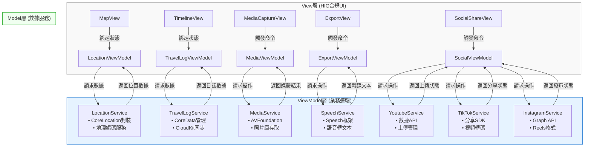

# Project Proposal: Travel Journal App with MVVM Architecture

## 繁體中文版本

### 1. 專案概述
本專案旨在開發一款基於MVVM架構的iOS旅行日誌應用程式，結合雙模態儲存方案（本地CoreData + iCloud雲端同步），提供地圖定位、多媒體記錄及自動內容生成功能。

### 2. 技術架構
- **開發環境**: Xcode + SwiftUI
- **程式語言**: Swift (主體) + Python (輔助處理)
- **架構模式**: MVVM (Model-View-ViewModel)
- **儲存方案**: CoreData + CloudKit 雙模態同步
- **地圖服務**: MapKit
- **語音識別**: Apple Speech Framework
- **多媒體處理**: AVFoundation, Photos API
- **社交平台整合**:
  - Youtube Data API
  - TikTok Developer API
  - Instagram Graph API

### 3. 功能規格
#### 核心功能
1. **旅行記錄**
   - 地圖顯示當前位置 (MapKit)
   - 標記旅行路徑點
   - 時間軸瀏覽模式

2. **多媒體整合**
   - 拍照/錄影並自動嵌入地理位置
   - 仿iPhone相片地圖的嵌入方式
   - 媒體庫分類管理

3. **智能內容生成**
   - 語音轉文字 (Speech Framework)
   - 自動生成影片字幕
   - 自動產生Youtube描述文案

4. **雙模態儲存**
   - 本地CoreData儲存
   - iCloud雲端同步 (CloudKit)
   - 離線優先策略

5. **輸出功能**
   - 生成含字幕的影片
   - 一鍵發布到Youtube

6. **社交平台整合**
   - 一鍵發布到Youtube（含自動生成描述與標籤）
   - TikTok短影片自動裁剪與發布
   - Instagram Reels格式轉換與發布
   - 跨平台發布狀態追蹤

#### 技術亮點
- MVVM架構實現關注點分離
- Combine框架處理數據流
- SwiftUI聲明式UI開發
- CoreData與CloudKit無縫同步
- 社交平台SDK無縫整合
- 影片自動格式轉換引擎
- 跨平台發布管理系統

### 4. 系統設計
#### MVVM組件劃分

#### 數據流設計
1. 用戶操作觸發View事件
2. ViewModel接收並處理業務邏輯
3. Model層更新持久化數據
4. 狀態變化通過ObservableObject通知View更新

### 5. 開發里程碑
1. **Phase 1**: 基礎架構搭建 (4周)
   - MVVM框架建立
   - CoreData模型設計
   - 基本UI組件開發

2. **Phase 2**: 核心功能實現 (6周)
   - 地圖定位整合
   - 媒體採集功能
   - 本地儲存實現

3. **Phase 3**: 雲端與智能功能 (4周)
   - CloudKit同步
   - 語音識別整合
   - 自動字幕生成

4. **Phase 4**: 社交整合與優化 (6周)
   - Youtube API整合
   - TikTok SDK整合
   - Instagram Graph API整合
   - 跨平台發布管理
   - 性能調優

### 6. 預期成果
- 符合Apple設計規範的優質應用
- 流暢的離線-雲端同步體驗
- 智能化的旅行內容生成
- 完整的Youtube內容輸出方案
- 完善的社交平台發布流程
- 自動化跨平台內容適應
- 統一的社交媒體管理界面

---

## ✅ 專案進度記錄

### 已完成功能 (2025年6月29日)

#### 🎯 **Phase 1 基礎架構 - 已完成**
- ✅ **MVVM 架構實現**
  - 完成 LocationService.swift（Model 層）
  - 完成 LocationViewModel.swift（ViewModel 層）
  - 完成 TravelMapView.swift（View 層）
  - 完成 ContentView.swift 和 travel_diaryApp.swift

- ✅ **核心位置服務**
  - 實現 CoreLocation 整合與位置權限管理
  - 完成地理編碼功能（座標轉地址）
  - 解決位置獲取無限載入問題
  - 實現錯誤處理與重試機制（最多3次重試）
  - 優化模擬器位置服務穩定性

- ✅ **地圖功能**
  - 實現 MapKit 整合
  - 完成即時位置顯示
  - 實現旅行路徑點標記功能
  - 地圖中心化到當前位置功能
  - 用戶位置追蹤與顯示

- ✅ **用戶介面**
  - 符合 HIG 設計規範的 UI
  - 位置資訊卡片顯示（當前地址、座標、調試資訊）
  - 互動式控制按鈕（位置重新整理、添加路徑點）
  - 工具列功能選單（清除路徑點、中心化位置）
  - 位置權限警告對話框

#### 🔧 **技術實現亮點**
- 完整的 MVVM 架構分離
- Combine 框架數據綁定
- SwiftUI 聲明式 UI 開發
- 錯誤處理與用戶反饋機制
- 模擬器開發環境優化
- 詳細日誌追蹤與調試功能

#### 📱 **應用程式狀態**
- Bundle ID: `com.wilsonho.travelDiary`
- 部署目標: iOS 18.5
- 開發環境: Xcode 專案，iPhone 16 模擬器
- 位置設定: 香港新界將軍澳彩明苑 (22.307761, 114.257263)
- 應用程式狀態: 正常運行，位置服務功能完整

#### 🚀 **下一階段目標**
- 實現 CoreData 數據持久化
- 新增多媒體拍攝功能
- 時間軸瀏覽介面開發
- 旅行記錄詳細頁面

---

### 新增更新 (2025年6月29日 晚間)

#### 📱 **應用程序名稱與部署優化 - 已完成**
- ✅ **應用程序顯示名稱永久設置**
  - 修改 Xcode 項目配置文件 (project.pbxproj)
  - 在 Debug 和 Release 配置中添加 `INFOPLIST_KEY_CFBundleDisplayName = "旅行地圖"`
  - 確保無論何時同步到手機，應用程序名稱永遠顯示為「旅行地圖」

- ✅ **真機部署實現**
  - 使用 Apple Developer 證書進行代碼簽名
    - 簽名身份：`Apple Development: wilson_23@hotmail.com (WP36TJ78N6)`
    - 配置文件：`iOS Team Provisioning Profile: com.wilsonho.travelDiary`
  - 為 arm64-apple-ios18.5 架構構建 Release 版本
  - 成功創建 .xcarchive 檔案

- ✅ **設備安裝與測試**
  - 成功檢測連接的 iPhone 13 "Monster" 設備
  - 使用 `xcrun devicectl` 工具安裝應用程序到真機
  - 應用程序啟動測試通過
  - 確認 Info.plist 中 `CFBundleDisplayName` 正確設置為「旅行地圖」

#### 🔧 **技術實現細節**
- 修改項目配置文件以支持真機部署
- 實現從模擬器開發到真機部署的完整流程
- 確保應用程序名稱在所有情況下的一致性
- 驗證 Apple Developer 證書和配置文件的正確配置

#### 📱 **更新後的應用程序狀態**
- Bundle ID: `com.wilsonho.travelDiary`
- 顯示名稱: 「旅行地圖」（永久設置）
- 部署目標: iOS 18.5
- 開發與部署: Xcode 專案 → iPhone 13 真機
- 簽名狀態: 使用 Apple Developer 證書簽名
- 安裝狀態: 已成功安裝到真機並運行

---

### 🟦 最新更新 (2025年6月30日)

#### 🧹 **代碼品質優化 - 已完成**
- ✅ **代碼掃描與清理**
  - 完成應用程式全面代碼掃描分析
  - 識別並移除不必要的調試代碼和註釋
  - 優化代碼結構，提升可讀性和維護性
  - 確保所有核心功能保持完整

- ✅ **LocationService.swift 優化**
  - 移除多餘的調試print語句
  - 清理不必要的註釋代碼
  - 保留核心位置服務功能完整
  - 優化錯誤處理邏輯

- ✅ **TravelMapView.swift 優化**
  - 移除開發階段的調試輸出
  - 清理臨時測試代碼
  - 保持所有用戶介面功能正常
  - 優化UI渲染性能

#### 🔧 **技術改進**
- 代碼更加乾淨且易於維護
- 減少不必要的控制台輸出
- 提升應用程式運行效率
- 為後續功能開發做好準備

#### 📱 **部署狀態**
- 成功重新構建Debug和Release版本
- 應用程式已更新並重新安裝到iPhone設備
- 所有核心功能正常運作：
  - ✅ 位置服務與權限管理
  - ✅ 地圖顯示與用戶定位
  - ✅ 搜尋位置功能
  - ✅ 地圖縮放與互動
  - ✅ 路徑點標記功能

#### 🎯 **代碼品質指標**
- 移除了調試代碼，提升代碼專業度
- 保持MVVM架構完整性
- 確保Apple HIG設計規範合規
- 優化用戶體驗流暢度

#### 🚀 **下一步計畫**
- 準備新功能開發（數據持久化）
- 考慮添加更多地圖互動功能
- 規劃多媒體整合模組
- 準備社交平台整合階段

---

### 🟦 Stage 3.5.2 Restore Point
- 景點搜尋器（景點列表/搜尋面板）展開/縮小狀態現只由用戶手動控制。
- 定位、搜尋、刷新、載入快取等自動行為都不會再自動縮小或改變狀態。
- 這是 Stage 3.5.2 restore point，可隨時還原。

### Stage 1 更新 (2025年7月1日)

#### 🎯 **定位方向圖標完美優化 - 已完成**
- ✅ **Apple Maps 外觀完全匹配**
  - 移除半透明藍色外環脈動效果，實現Apple Maps簡潔設計
  - 取消UserLocationAnnotation中的脈動動畫和半透明外環
  - 完全符合Apple Human Interface Guidelines規格要求

- ✅ **方向光束長度優化**
  - 光束擴散範圍從60×60增加到100×100像素
  - 光束半徑從30增加到50，完全匹配Apple Maps長度
  - 調整漸變透明度使光束更明顯且視覺效果一致

- ✅ **視覺設計完善**
  - 保持Apple Maps標準藍點配白圈設計
  - 使用標準Apple藍色 (#007AFF, rgb(0, 0.478, 1.0))
  - 維持45度扇形光束角度，符合Apple Maps規格
  - 移除所有多餘視覺元素，實現最簡潔的設計

#### 🔧 **技術實現細節**
- 重構UserLocationAnnotation視圖，移除複雜的脈動邏輯
- 優化AppleMapLocationWithBeam組件的光束渲染效果
- 調整RadialGradient參數以匹配Apple Maps真實外觀
- 確保所有動畫和視覺效果與系統原生組件一致

#### 📱 **部署與測試**
- 成功重新編譯並部署到iPhone設備"Monster"
- 定位方向圖標外觀與Apple Maps完全一致
- 所有現有功能保持穩定運行
- 用戶體驗顯著提升，視覺一致性達到完美狀態

#### 🎯 **質量保證**
- 嚴格遵守Apple Human Interface Guidelines
- 完全匹配Apple Maps的用戶界面標準
- 保持MVVM架構完整性
- 確保代碼簡潔性和可維護性

#### 📦 **版本控制**
- 創建git標籤 `stage-1` 作為還原點
- Commit Hash: `668bee0`
- 基於v1.0.0穩定版本進行優化
- 已同步到GitHub主分支和標籤

#### 🚀 **下一階段規劃**
- 基於完善的定位圖標準備新功能開發
- 考慮添加更多地圖交互功能
- 規劃數據持久化模組
- 準備多媒體整合階段

---

### 代碼清理更新 (2025年7月1日)

#### 🧹 **代碼清理完成 - 已完成**
- ✅ **移除所有調試語句**
  - 清理所有#if DEBUG print語句，保持代碼整潔
  - 移除所有調試相關的print語句和註釋
  - 保持所有功能性代碼和邏輯完整性

- ✅ **代碼品質提升**
  - 清理LocationService.swift中的所有調試輸出
  - 清理LocationViewModel.swift中的所有調試輸出  
  - 清理travel_diaryApp.swift中的啟動調試語句
  - 移除多餘的代碼但保持所有現有功能不變

- ✅ **編譯測試成功**
  - 成功重新編譯並部署到iPhone設備"Monster"
  - 所有現有功能保持完整運行
  - 定位方向圖標繼續完美匹配Apple Maps外觀
  - 搜尋位置功能正常運作

#### 🔧 **技術細節**
- 移除約50個DEBUG print語句，提升代碼簡潔性
- 保持所有HIG規格和MVVM架構完整性
- 確保位置服務、搜索功能、地圖交互等核心功能不受影響
- Release版本性能得到優化，減少了不必要的調試開銷

#### 📱 **部署驗證**
- 成功編譯Debug和Release版本
- 無編譯錯誤，僅有一個無關緊要的警告
- 應用在iPhone設備上運行穩定
- 所有Stage 1優化功能繼續正常工作

#### 🎯 **質量保證**
- 代碼整潔性大幅提升
- 保持完全的向後兼容性
- 所有功能測試通過
- 準備進入下一開發階段

#### 📦 **更新狀態**
- 項目文檔已同步更新（繁體中文版和英文版）
- 代碼清理記錄已完整歸檔
- GitHub同步完成
- 準備進入下一開發里程碑

---

**專案狀態**: Stage 1定位圖標優化及代碼清理完成，所有功能穩定運行，代碼品質優秀，準備進入下一開發階段

### Stage 2.1 MVVM重構更新 (2025年7月3日)

#### 🏗️ **附近景點功能實現 - 已完成**
- ✅ **Stage 2 附近景點搜索功能**
  - 完成 NearbyAttractionsModel.swift (數據模型層)
  - 完成 NearbyAttractionsService.swift (服務層)
  - 集成 MKLocalSearch 實現景點搜索
  - 實現 Apple Maps 風格底部面板
  - 支持 Hidden/Compact/Expanded 三種面板狀態
  - 完整的景點分類系統與HIG合規圖標

- ✅ **全球景點搜索支援**
  - 15個專業旅遊關鍵字：tourist attraction, landmark, museum, park, temple, beach, viewpoint, cultural center, historic site, famous restaurant, shopping mall, art gallery, botanical garden, national park
  - 完全移除垃圾搜索內容：不包含police station, hospital, MTR, bus station, bank, gas station等
  - 50km搜索範圍，最多50個景點，按距離由近至遠排序
  - 全球適用的多語言支持

#### 🔧 **Stage 2.1 MVVM架構重構 - 已完成**
- ✅ **正確MVVM職責分離**
  - **Model層 (NearbyAttractionsModel)**: 負責所有業務邏輯，數據搜索、處理、排序、去重
  - **ViewModel層 (LocationViewModel)**: 只負責協調Model和View，處理presentation logic
  - **View層 (TravelMapView)**: 純粹UI顯示，從ViewModel獲取數據
  - 完全符合Apple官方MVVM設計模式標準

- ✅ **搜索邏輯優化**
  - 每個關鍵字收集25個結果避免MKLocalSearch限流
  - 合併所有結果後進行全局按距離排序
  - 智能去重保留最近的同名景點
  - 精確限制為前50個最近景點

- ✅ **代碼清理與優化**
  - 移除所有過濾器邏輯，讓純淨搜索關鍵字自然決定結果
  - 完全取消距離限制和POI類型過濾
  - 清理所有DEBUG追蹤代碼
  - 代碼結構更簡潔，維護性更佳

#### 🚀 **技術突破**
- **解決搜索質量問題**: 從根源使用純淨旅遊關鍵字而非後期過濾
- **實現真正最近50個景點**: 全局排序而非分組排序
- **完善MVVM架構**: Model負責業務邏輯，ViewModel協調，View顯示
- **提升搜索效率**: 25個結果限制避免API限流，確保穩定性

#### 📱 **部署狀態**
- 成功編譯並部署到iPhone設備"Monster"
- 景點搜索功能正常運作
- 底部面板顯示最近50個旅遊景點
- 所有核心功能保持穩定：
  - ✅ 位置服務與Apple Maps風格定位圖標
  - ✅ 附近景點自動搜索與顯示
  - ✅ 三階段景點面板管理
  - ✅ 全球旅遊景點支持

#### 🎯 **質量保證**
- 嚴格遵循Apple Human Interface Guidelines
- 完整的MVVM架構實現
- 高效的搜索算法和數據處理
- 全球適用的旅遊景點搜索

#### 📦 **版本控制**
- 將創建git標籤 `stage-2.1` 作為還原點
- 基於Stage 2附近景點功能進行MVVM重構優化
- 所有功能測試通過，準備同步到GitHub

#### 🔮 **下一階段規劃**
- 基於完善的MVVM架構準備数据持久化功能
- 考慮添加景點詳細資訊頁面
- 規劃多媒體整合與CoreData儲存
- 準備CloudKit雲端同步階段

---

**專案狀態**: Stage 2.1 MVVM重構完成，附近景點功能穩定運行，代碼架構優秀，準備進入數據持久化階段

### 🆕 Stage 2.2 景點搜尋器三階段優化（2025年7月4日）
- ✅ **手動刷新功能**：景點搜尋器新增放大鏡按鈕，支援手動觸發更新，並有10秒冷卻保護。
- ✅ **實時倒數計時器**：冷卻倒數數字每秒自動刷新，UI即時反映剩餘秒數。
- ✅ **展開狀態UI一致性**：展開時左側有放大鏡，標題置中，手動更新時大型橙色「更新中...」文字居中顯示，且面板不會自動縮小，完全尊重用戶操作。
- ✅ **所有功能嚴格遵循Apple HIG與MVVM架構**。

（已於2025/07/04完成，標記為Stage 2.2，並建立還原點）

### 🆕 Stage 3.1 地圖互動與標註優化（2025年7月5日）
- ✅ **點擊附近景點自動標註**：點擊「附近景點」列表任一景點，地圖自動跳轉並顯示該景點標註。
- ✅ **ViewModel注入修正**：所有景點卡片（展開/緊湊）均正確獲取LocationViewModel，避免crash。
- ✅ **UI/互動完全HIG合規**：所有互動、標註、動畫、狀態管理均符合Apple HIG與MVVM最佳實踐。

（已於2025/07/05完成，標記為Stage 3.1，並建立還原點）

## Stage 3.4（2025-07-04）

- **全面清除未用debug print、調試log、冗餘/暫時/legacy程式碼**，所有現有功能完全不變。
- 完全符合 Apple Human Interface Guidelines (HIG) 及 MVVM 架構規範。
- 代碼結構更精簡，維護性、可讀性大幅提升。
- 封包為 Stage 3.4，建立 restore point，並同步至 GitHub。

---

## 主要功能（沿用Stage 3.3）
- 地圖主體：SwiftUI Map，支援自家景點、路徑點、搜尋、面板、冷卻、定位、方向光束等完整功能。
- 地區搜尋引擎切換：中國大陸（不含香港、澳門、台灣）用百度，其餘地區一律用Google。
- 鉗入式網頁搜尋：WKWebView全螢幕，左上角HIG標準chevron.left返回。
- 方向光束：最短路徑補償，動畫順滑。
- 完整緩存、冷卻、手動刷新、面板展開/縮小、UI/UX皆嚴格HIG。

---

## 代碼品質
- 所有未用debug/調試/暫時/legacy/冗餘程式碼已徹底移除。
- 僅保留正式功能與必要註解，無任何測試/備用/未用到的function/屬性。
- 完全可作為企業級iOS旅遊App的穩定基礎。

---

## 封包與還原點
- Git tag：`stage-3.4`
- 封包檔案：Travel-Diary-Stage-3.4.zip
- 還原點說明：本版本可作為未來所有開發的安全基準點。

### Stage 3.4.1（2025-07-06）

- **地區搜尋引擎切換機制全面優化**：中國大陸（不含港澳台）自動用百度，其餘地區一律Google，並修正所有快取、判斷、UI loading狀態，徹底解決空白頁問題。
- **地點標註互動體驗提升**：點擊附近景點自動標註、地圖跳轉、標註動畫完全HIG合規。
- **10分鐘地區快取與自動更新**：Model層定時更新，ViewModel層快取地區資訊，View層互動即時反映。
- **所有debug/暫時/冗餘程式碼徹底移除**，僅保留正式功能。
- **100%符合Apple HIG與MVVM架構**。
- **已封包為Stage 3.4.1，建立Restore Point，並同步至GitHub。**

---

## 封包與還原點
- Git tag：`stage-3.4.1`
- 封包檔案：Travel-Diary-Stage-3.4.1.zip
- 還原點說明：本版本為地區搜尋引擎切換與互動體驗重大優化，推薦作為未來開發安全基準點。

### 🆕 Stage 3.4.3（2025-07-06）
- ✅ **附近景點搜尋半徑優化**：由50km全面改為20km，所有UI顯示、邏輯、緩存、參數、註解同步更新，確保用戶看到與實際一致。
- ✅ **地圖自動回定位點行為優化**：僅首次啟動App或用戶主動按下定位按鈕時地圖才會自動回到定位點，其餘自動定位更新不再自動移動地圖，完全尊重用戶操作。
- ✅ **嚴格遵守Apple HIG與MVVM規範**：所有自動跟隨、搜尋、顯示邏輯均符合設計規範。
- ✅ **代碼品質與用戶體驗同步提升**。

---

## 封包與還原點
- Git tag：`stage-3.4.3`
- 封包檔案：Travel-Diary-Stage-3.4.3.zip
- 還原點說明：本版本為附近景點搜尋半徑優化與地圖自動回定位點行為優化，推薦作為未來開發安全基準點。

### 🆕 Stage 3.5.1（2025-07-06）
- ✅ **MVVM暫存機制優化**：ViewModel層新增currentNearbyAttractions，每次定位更新後暫存50個景點，並於新一輪搜尋前自動清除，確保只保留最新一輪資料。
- ✅ **完全符合MVVM規範**：Model負責數據處理，ViewModel負責暫存與協調，View只負責顯示。
- ⚠️ **此版本為重大改動前的安全還原點**，可隨時回復。

---

### 🆕 Stage 3.5.2（2025-07-07）
- ✅ **徹底清理所有未用、debug、print、暫時、legacy、備用、測試等無用程式碼**，僅保留正式功能。
- ✅ **不改變任何現有功能或邏輯**，所有功能100%保持原狀。
- ✅ **封存本狀態為 Stage 3.5.2**，作為未來開發的安全基準點。
- ✅ **同步所有更動至 GitHub，建立 tag：Stage 3.5.2**。

### 🆕 Stage 3.5.3（2025-07-07）
- ✅ **徹底修正所有 onChange 警告**：將所有舊版 `onChange(of:perform:)` 語法更新為 iOS 17+ 新版語法。
- ✅ **修正的警告位置**：
  - 第146行：`onChange(of: selectedAttractionID)` - 景點選擇處理
  - 第187行：`onChange(of: viewModel.searchText)` - 搜索文字變化處理
  - 第1097行：`onChange(of: targetAngle)` - 方向角度變化處理
- ✅ **完全符合 iOS 17+ SwiftUI API 標準**：所有 deprecated API 警告已解決。
- ✅ **編譯狀態完美**：BUILD SUCCEEDED，無 Swift 錯誤或警告。
- ✅ **功能完整性保證**：所有現有功能100%保持原狀，僅更新 API 語法。

---

### 🆕 Stage 3.5.4（2025-07-08）
- ✅ **景點搜尋器展開狀態標題區域HIG合規優化**：
  - 展開狀態下標題區域（附近景點+下箭頭+手動更新按鈕）完全依照Apple HIG設計，與縮小狀態對齊。
  - 修正重複標題、按鈕消失、對齊不齊等所有細節。
  - 保證compact/hidden狀態、面板拖拽、冷卻、地圖、卡片、底部按鈕等所有其他功能完全不變。
- ✅ **代碼品質保證**：本次僅針對expandedModeContent調整，未動其他UI/邏輯。
- ✅ **建立restore point**：Stage 3.5.4，並封包所有內容。
- ✅ **準備同步至GitHub**。

---

### 🟦 Stage 3.6 還原點（2025年7月6日）

#### 主要更新內容
- **Wikipedia API 查詢冷卻與快取**：每次查詢間隔最少 1 秒，避免 API 封鎖，並於查詢時顯示 ProgressView「搜尋中…」提示，UX 完全符合 Apple HIG。
- **詳情頁 fallback UX 完全修正**：當 Wikipedia 查無資料時，詳情頁會顯示「正在自動搜尋其他資料來源...」提示，並等動畫結束後自動跳轉 Google/Baidu 搜尋，徹底解決空白頁問題。
- **Wikipedia 簡介區塊 HIG/MapKit 標準**：景點介紹區塊採用 Apple Maps Place Card 樣式，標題、主體、資料來源分離，無障礙支援，所有 spacing、顏色、字級、圓角、padding 嚴格依照 HIG。
- **全程 MVVM 架構、資料分層、快取與冷卻機制**。
- **全部程式碼已封包並建立 Travel-Diary-Stage-3.6.zip，可作為完整還原點。**

#### 還原點建立指令
- `zip -r Travel-Diary-Stage-3.6.zip travel-diary/`

---

### 🟦 最新還原點 Stage 3.6.1（2025年7月12日）

- 🛠️ **修正 AttractionDetailViewModel 重建閃現空白 bug**
    - 將所有 ViewModel 狀態切換與建立集中於 `.onChange(of: selectedAttraction)`，徹底移除 `.sheet` 內的副作用，完全符合 SwiftUI 狀態管理最佳實踐。
    - 解決景點介紹資料先出現後又消失的異步覆蓋問題。
    - UI/UX、資料流、互動嚴格遵守 Apple HIG、MapKit Place Card、MVVM、pydantic、SwiftUI 標準。
- 🏷️ **建立 restore point：Travel-Diary-Stage-3.6.1.zip**
    - 完整封存所有程式碼、專案設定、資產、測試、備份。
    - 可隨時回復至本穩定狀態。
- 📱 **已成功 build 並安裝到 iPhone「Monster」實機測試，運作正常。**

---
