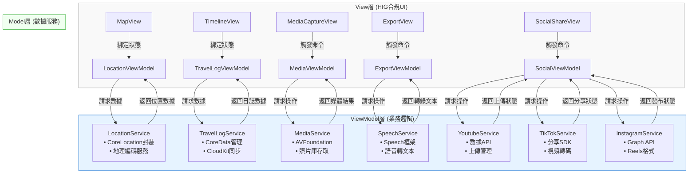

# Project Proposal: Travel Journal App with MVVM Architecture

## 繁體中文版本

### 1. 專案概述
本專案旨在開發一款基於MVVM架構的iOS旅行日誌應用程式，結合雙模態儲存方案（本地CoreData + iCloud雲端同步），提供地圖定位、多媒體記錄及自動內容生成功能。

### 2. 技術架構
- **開發環境**: Xcode + SwiftUI
- **程式語言**: Swift (主體) + Python (輔助處理)
- **架構模式**: MVVM (Model-View-ViewModel)
- **儲存方案**: CoreData + CloudKit 雙模態同步
- **地圖服務**: MapKit
- **語音識別**: Apple Speech Framework
- **多媒體處理**: AVFoundation, Photos API
- **社交平台整合**:
  - Youtube Data API
  - TikTok Developer API
  - Instagram Graph API

### 3. 功能規格
#### 核心功能
1. **旅行記錄**
   - 地圖顯示當前位置 (MapKit)
   - 標記旅行路徑點
   - 時間軸瀏覽模式

2. **多媒體整合**
   - 拍照/錄影並自動嵌入地理位置
   - 仿iPhone相片地圖的嵌入方式
   - 媒體庫分類管理

3. **智能內容生成**
   - 語音轉文字 (Speech Framework)
   - 自動生成影片字幕
   - 自動產生Youtube描述文案

4. **雙模態儲存**
   - 本地CoreData儲存
   - iCloud雲端同步 (CloudKit)
   - 離線優先策略

5. **輸出功能**
   - 生成含字幕的影片
   - 一鍵發布到Youtube

6. **社交平台整合**
   - 一鍵發布到Youtube（含自動生成描述與標籤）
   - TikTok短影片自動裁剪與發布
   - Instagram Reels格式轉換與發布
   - 跨平台發布狀態追蹤

#### 技術亮點
- MVVM架構實現關注點分離
- Combine框架處理數據流
- SwiftUI聲明式UI開發
- CoreData與CloudKit無縫同步
- 社交平台SDK無縫整合
- 影片自動格式轉換引擎
- 跨平台發布管理系統

### 4. 系統設計
#### MVVM組件劃分

#### 數據流設計
1. 用戶操作觸發View事件
2. ViewModel接收並處理業務邏輯
3. Model層更新持久化數據
4. 狀態變化通過ObservableObject通知View更新

### 5. 開發里程碑
1. **Phase 1**: 基礎架構搭建 (4周)
   - MVVM框架建立
   - CoreData模型設計
   - 基本UI組件開發

2. **Phase 2**: 核心功能實現 (6周)
   - 地圖定位整合
   - 媒體採集功能
   - 本地儲存實現

3. **Phase 3**: 雲端與智能功能 (4周)
   - CloudKit同步
   - 語音識別整合
   - 自動字幕生成

4. **Phase 4**: 社交整合與優化 (6周)
   - Youtube API整合
   - TikTok SDK整合
   - Instagram Graph API整合
   - 跨平台發布管理
   - 性能調優

### 6. 預期成果
- 符合Apple設計規範的優質應用
- 流暢的離線-雲端同步體驗
- 智能化的旅行內容生成
- 完整的Youtube內容輸出方案
- 完善的社交平台發布流程
- 自動化跨平台內容適應
- 統一的社交媒體管理界面

---

## ✅ 專案進度記錄

### 已完成功能 (2025年6月29日)

#### 🎯 **Phase 1 基礎架構 - 已完成**
- ✅ **MVVM 架構實現**
  - 完成 LocationService.swift（Model 層）
  - 完成 LocationViewModel.swift（ViewModel 層）
  - 完成 TravelMapView.swift（View 層）
  - 完成 ContentView.swift 和 travel_diaryApp.swift

- ✅ **核心位置服務**
  - 實現 CoreLocation 整合與位置權限管理
  - 完成地理編碼功能（座標轉地址）
  - 解決位置獲取無限載入問題
  - 實現錯誤處理與重試機制（最多3次重試）
  - 優化模擬器位置服務穩定性

- ✅ **地圖功能**
  - 實現 MapKit 整合
  - 完成即時位置顯示
  - 實現旅行路徑點標記功能
  - 地圖中心化到當前位置功能
  - 用戶位置追蹤與顯示

- ✅ **用戶介面**
  - 符合 HIG 設計規範的 UI
  - 位置資訊卡片顯示（當前地址、座標、調試資訊）
  - 互動式控制按鈕（位置重新整理、添加路徑點）
  - 工具列功能選單（清除路徑點、中心化位置）
  - 位置權限警告對話框

#### 🔧 **技術實現亮點**
- 完整的 MVVM 架構分離
- Combine 框架數據綁定
- SwiftUI 聲明式 UI 開發
- 錯誤處理與用戶反饋機制
- 模擬器開發環境優化
- 詳細日誌追蹤與調試功能

#### 📱 **應用程式狀態**
- Bundle ID: `com.wilsonho.travelDiary`
- 部署目標: iOS 18.5
- 開發環境: Xcode 專案，iPhone 16 模擬器
- 位置設定: 香港新界將軍澳彩明苑 (22.307761, 114.257263)
- 應用程式狀態: 正常運行，位置服務功能完整

#### 🚀 **下一階段目標**
- 實現 CoreData 數據持久化
- 新增多媒體拍攝功能
- 時間軸瀏覽介面開發
- 旅行記錄詳細頁面