## English Version

### 1. Project Overview
This project aims to develop an iOS travel journal application based on MVVM architecture, featuring a dual-mode storage solution (local CoreData + iCloud sync), map positioning, multimedia recording, and automated content generation.

### 2. Technical Architecture
- **Development Environment**: Xcode + SwiftUI
- **Programming Languages**: Swift (main) + Python (auxiliary)
- **Architecture**: MVVM (Model-View-ViewModel)
- **Storage Solution**: CoreData + CloudKit dual-mode sync
- **Map Service**: MapKit
- **Speech Recognition**: Apple Speech Framework
- **Multimedia Processing**: AVFoundation, Photos API
- **Social Platform Integration**:
  - Youtube Data API
  - TikTok Developer API
  - Instagram Graph API

### 3. Feature Specifications
#### Core Features
1. **Travel Logging**
   - Map display with current location (MapKit)
   - Travel path marking
   - Timeline browsing mode

2. **Multimedia Integration**
   - Photo/video capture with automatic geotagging
   - iPhone-style photo map embedding
   - Media library categorization

3. **Smart Content Generation**
   - Speech-to-text (Speech Framework)
   - Automated video subtitles
   - Auto-generated Youtube descriptions

4. **Dual-mode Storage**
   - Local CoreData storage
   - iCloud sync (CloudKit)
   - Offline-first strategy

5. **Export Functionality**
   - Video generation with subtitles
   - One-click Youtube publishing

6. **Social Platform Integration**
   - One-click publishing to Youtube (with auto-generated descriptions & tags)
   - TikTok short video auto-cropping & publishing
   - Instagram Reels format conversion & publishing
   - Cross-platform publishing status tracking

#### Technical Highlights
- MVVM architecture for separation of concerns
- Combine framework for data flow
- SwiftUI declarative UI development
- Seamless CoreData-CloudKit sync
- Seamless social platform SDK integration
- Automatic video format conversion engine
- Cross-platform publishing management system

### 4. System Design
#### MVVM Component Breakdown

```mermaid
flowchart TD
    subgraph ViewLayer["View Layer (HIG Compliant UI)"]
        A[MapView] -->|Bind state| B[LocationViewModel]
        C[TimelineView] -->|Bind state| D[TravelLogViewModel]
        E[MediaCaptureView] -->|Trigger command| F[MediaViewModel]
        G[ExportView] -->|Trigger command| H[ExportViewModel]
        I[SocialShareView] -->|Trigger command| J[SocialViewModel]
    end

    subgraph ViewModelLayer["ViewModel Layer (Business Logic)"]
        B -->|Request data| K[LocationService]
        D -->|Request data| L[TravelLogService]
        F -->|Request operation| M[MediaService]
        H -->|Request operation| N[SpeechService]
        J -->|Request operation| O[YoutubeService]
        J -->|Request operation| P[TikTokService]
        J -->|Request operation| Q[InstagramService]
    end

    subgraph ModelLayer["Model Layer (Data Services)"]
        K[LocationService\n• CoreLocation wrapper\n• Geocoding]
        L[TravelLogService\n• CoreData manager\n• CloudKit sync]
        M[MediaService\n• AVFoundation\n• Photo library]
        N[SpeechService\n• Speech framework\n• Speech-to-text]
        O[YoutubeService\n• Data API\n• Upload manager]
        P[TikTokService\n• Share SDK\n• Video transcoding]
        Q[InstagramService\n• Graph API\n• Reels format]
        
        K -->|Return location| B
        L -->|Return log data| D
        M -->|Return media result| F
        N -->|Return transcript| H
        O -->|Return upload status| J
        P -->|Return share status| J
        Q -->|Return publish status| J
    end

    style ViewLayer fill:#f9f9f9,stroke:#aaa
    style ViewModelLayer fill:#e6f3ff,stroke:#0066cc
    style ModelLayer fill:#f0fff0,stroke:#009900
```

#### Data Flow Design
1. User actions trigger View events
2. ViewModel receives and processes business logic
3. Model layer updates persistent data
4. State changes propagate to View via ObservableObject

### 5. Development Milestones
1. **Phase 1**: Foundation Setup (4 weeks)
   - MVVM framework establishment
   - CoreData model design
   - Basic UI components development

2. **Phase 2**: Core Feature Implementation (6 weeks)
   - Map integration
   - Media capture functionality
   - Local storage implementation

3. **Phase 3**: Cloud & AI Features (4 weeks)
   - CloudKit synchronization
   - Speech recognition integration
   - Auto-subtitle generation

4. **Phase 4**: Social Integration & Optimization (6 weeks)
   - Youtube API integration
   - TikTok SDK integration
   - Instagram Graph API integration
   - Cross-platform publishing management
   - Performance tuning

### 6. Expected Outcomes
- High-quality app compliant with Apple design guidelines
- Smooth offline-cloud sync experience
- Intelligent travel content generation
- Complete Youtube content export solution
- Comprehensive social platform publishing workflow
- Automated cross-platform content adaptation
- Unified social media management interface

---

## ✅ Project Progress Log

### Completed Features (June 29, 2025)

#### 🎯 **Phase 1 Foundation - Completed**
- ✅ **MVVM Architecture Implementation**
  - Completed LocationService.swift (Model Layer)
  - Completed LocationViewModel.swift (ViewModel Layer)
  - Completed TravelMapView.swift (View Layer)
  - Completed ContentView.swift and travel_diaryApp.swift

- ✅ **Core Location Services**
  - Implemented CoreLocation integration with permission management
  - Completed geocoding functionality (coordinates to address)
  - Fixed infinite location loading issue
  - Implemented error handling and retry mechanism (max 3 retries)
  - Optimized simulator location service stability

- ✅ **Map Functionality**
  - Implemented MapKit integration
  - Completed real-time location display
  - Implemented travel path point marking
  - Map centering to current location feature
  - User location tracking and display

- ✅ **User Interface**
  - HIG-compliant UI design
  - Location info card display (current address, coordinates, debug info)
  - Interactive control buttons (location refresh, add path points)
  - Toolbar functionality menu (clear path points, center location)
  - Location permission alert dialogs

#### 🔧 **Technical Implementation Highlights**
- Complete MVVM architecture separation
- Combine framework data binding
- SwiftUI declarative UI development
- Error handling and user feedback mechanisms
- Simulator development environment optimization
- Detailed logging and debugging functionality

#### 📱 **Application Status**
- Bundle ID: `com.wilsonho.travelDiary`
- Deployment Target: iOS 18.5
- Development Environment: Xcode project, iPhone 16 Simulator
- Location Setting: Hong Kong Tseung Kwan O Choi Ming Court (22.307761, 114.257263)
- Application Status: Running normally, location services fully functional

#### 🚀 **Next Phase Goals**
- Implement CoreData data persistence
- Add multimedia capture functionality
- Develop timeline browsing interface
- Create detailed travel record pages

---

### Latest Updates (June 29, 2025 Evening)

#### 📱 **App Name and Deployment Optimization - Completed**
- ✅ **Permanent App Display Name Configuration**
  - Modified Xcode project configuration file (project.pbxproj)
  - Added `INFOPLIST_KEY_CFBundleDisplayName = "旅行地圖"` to both Debug and Release configurations
  - Ensured app name always displays as "旅行地圖" (Travel Map) whenever synced to device

- ✅ **Physical Device Deployment Implementation**
  - Used Apple Developer certificate for code signing
    - Signing Identity: `Apple Development: wilson_23@hotmail.com (WP36TJ78N6)`
    - Provisioning Profile: `iOS Team Provisioning Profile: com.wilsonho.travelDiary`
  - Built Release version for arm64-apple-ios18.5 architecture
  - Successfully created .xcarchive package

- ✅ **Device Installation and Testing**
  - Successfully detected connected iPhone 13 "Monster" device
  - Used `xcrun devicectl` tool to install app on physical device
  - App launch testing passed
  - Confirmed Info.plist `CFBundleDisplayName` correctly set to "旅行地圖"

#### 🔧 **Technical Implementation Details**
- Modified project configuration files to support physical device deployment
- Implemented complete workflow from simulator development to device deployment
- Ensured app name consistency across all scenarios
- Verified proper Apple Developer certificate and provisioning profile configuration

#### 📱 **Updated Application Status**
- Bundle ID: `com.wilsonho.travelDiary`
- Display Name: "旅行地圖" (Travel Map) - permanently configured
- Deployment Target: iOS 18.5
- Development & Deployment: Xcode Project → iPhone 13 Physical Device
- Signing Status: Signed with Apple Developer certificate
- Installation Status: Successfully installed on device and running

---

### Latest Updates (June 30, 2025)

#### 🧹 **Code Quality Optimization - Completed**
- ✅ **Code Scanning & Cleanup**
  - Completed comprehensive code scanning analysis
  - Identified and removed unnecessary debug code and comments
  - Optimized code structure for better readability and maintainability
  - Ensured all core functionality remains intact

- ✅ **LocationService.swift Optimization**
  - Removed redundant debug print statements
  - Cleaned up unnecessary commented code
  - Preserved complete core location service functionality
  - Optimized error handling logic

- ✅ **TravelMapView.swift Optimization**
  - Removed development-stage debug output
  - Cleaned up temporary test code
  - Maintained all user interface functionality
  - Optimized UI rendering performance

#### 🔧 **Technical Improvements**
- Cleaner and more maintainable codebase
- Reduced unnecessary console output
- Enhanced application runtime efficiency
- Prepared foundation for future feature development

#### 📱 **Deployment Status**
- Successfully rebuilt Debug and Release versions
- Application updated and reinstalled on iPhone device
- All core features functioning normally:
  - ✅ Location services and permission management
  - ✅ Map display and user positioning
  - ✅ Location search functionality
  - ✅ Map zoom and interaction
  - ✅ Path point marking feature

#### 🎯 **Code Quality Metrics**
- Removed debug code, enhancing code professionalism
- Maintained MVVM architecture integrity
- Ensured Apple HIG design guideline compliance
- Optimized user experience fluidity

#### 🚀 **Next Steps**
- Prepare for new feature development (data persistence)
- Consider adding more map interaction features
- Plan multimedia integration modules
- Prepare for social platform integration phase

---

### Stage 1 Updates (July 1, 2025)

#### 🎯 **Location Direction Icon Perfect Optimization - Completed**
- ✅ **Complete Apple Maps Appearance Matching**
  - Removed semi-transparent blue ring pulsing effect, achieving Apple Maps clean design
  - Eliminated pulsing animation and semi-transparent ring from UserLocationAnnotation
  - Fully compliant with Apple Human Interface Guidelines specifications

- ✅ **Direction Beam Length Optimization**
  - Increased beam diffusion range from 60×60 to 100×100 pixels
  - Extended beam radius from 30 to 50, perfectly matching Apple Maps length
  - Adjusted gradient transparency to make beam more visible with consistent visual effects

- ✅ **Visual Design Enhancement**
  - Maintained Apple Maps standard blue dot with white ring design
  - Used standard Apple blue color (#007AFF, rgb(0, 0.478, 1.0))
  - Preserved 45-degree fan-shaped beam angle, conforming to Apple Maps specifications
  - Removed all redundant visual elements, achieving the most minimalist design

#### 🔧 **Technical Implementation Details**
- Refactored UserLocationAnnotation view, removing complex pulsing logic
- Optimized AppleMapLocationWithBeam component's beam rendering effects
- Adjusted RadialGradient parameters to match Apple Maps authentic appearance
- Ensured all animations and visual effects consistent with native system components

#### 📱 **Deployment and Testing**
- Successfully recompiled and deployed to iPhone device "Monster"
- Location direction icon appearance completely identical to Apple Maps
- All existing features remain stable and functional
- User experience significantly improved, visual consistency achieved perfect state

#### 🎯 **Quality Assurance**
- Strictly adheres to Apple Human Interface Guidelines
- Completely matches Apple Maps user interface standards
- Maintains MVVM architecture integrity
- Ensures code simplicity and maintainability

#### 📦 **Version Control**
- Created git tag `stage-1` as restore point
- Commit Hash: `668bee0`
- Optimized based on v1.0.0 stable version
- Synchronized to GitHub main branch and tags

#### 🚀 **Next Phase Planning**
- Prepare new feature development based on perfected location icon
- Consider adding more map interaction features
- Plan data persistence modules
- Prepare multimedia integration phase

---

### Code Cleanup Updates (July 1, 2025)

#### 🧹 **Code Cleanup Completed - Finished**
- ✅ **Removed All Debug Statements**
  - Cleaned all #if DEBUG print statements to maintain code cleanliness
  - Removed all debug-related print statements and comments
  - Preserved all functional code and logic integrity

- ✅ **Code Quality Enhancement**
  - Cleaned all debug output in LocationService.swift
  - Cleaned all debug output in LocationViewModel.swift
  - Cleaned startup debug statements in travel_diaryApp.swift
  - Removed redundant code while maintaining all existing functionality

- ✅ **Compilation Testing Success**
  - Successfully recompiled and deployed to iPhone device "Monster"
  - All existing features remain fully functional
  - Location direction icon continues to perfectly match Apple Maps appearance
  - Search location functionality works normally

#### 🔧 **Technical Details**
- Removed approximately 50 DEBUG print statements, improving code simplicity
- Maintained all HIG specifications and MVVM architecture integrity
- Ensured location services, search functionality, map interactions remain unaffected
- Release version performance optimized, reducing unnecessary debug overhead

#### 📱 **Deployment Verification**
- Successfully compiled Debug and Release versions
- No compilation errors, only one minor warning
- Application runs stably on iPhone device
- All Stage 1 optimization features continue to work properly

#### 🎯 **Quality Assurance**
- Code cleanliness significantly improved
- Maintained complete backward compatibility
- All functional tests passed
- Ready for next development phase

#### 📦 **Update Status**
- Project documentation synchronized and updated (Traditional Chinese and English versions)
- Code cleanup records completely archived
- GitHub synchronization completed
- Ready for next development milestone

---

**Project Status**: Stage 1 location icon optimization and code cleanup completed, all features running stably, excellent code quality, ready for next development phase

### Stage 2.1 MVVM Refactoring Updates (July 3, 2025)

#### 🏗️ **Nearby Attractions Feature Implementation - Completed**
- ✅ **Stage 2 Nearby Attractions Search Functionality**
  - Completed NearbyAttractionsModel.swift (Data Model Layer)
  - Completed NearbyAttractionsService.swift (Service Layer)
  - Integrated MKLocalSearch for attraction discovery
  - Implemented Apple Maps-style bottom panel
  - Support for Hidden/Compact/Expanded three panel states
  - Complete attraction categorization system with HIG-compliant icons

- ✅ **Global Attraction Search Support**
  - 15 professional tourism keywords: tourist attraction, landmark, museum, park, temple, beach, viewpoint, cultural center, historic site, famous restaurant, shopping mall, art gallery, botanical garden, national park
  - Completely eliminated junk search content: excludes police station, hospital, MTR, bus station, bank, gas station, etc.
  - 50km search radius, maximum 50 attractions, sorted by distance from nearest to farthest
  - Globally applicable multilingual support

#### 🔧 **Stage 2.1 MVVM Architecture Refactoring - Completed**
- ✅ **Proper MVVM Responsibility Separation**
  - **Model Layer (NearbyAttractionsModel)**: Handles all business logic, data search, processing, sorting, deduplication
  - **ViewModel Layer (LocationViewModel)**: Only coordinates Model and View, handles presentation logic
  - **View Layer (TravelMapView)**: Pure UI display, retrieves data from ViewModel
  - Fully compliant with Apple's official MVVM design pattern standards

- ✅ **Search Logic Optimization**
  - Collect 25 results per keyword to avoid MKLocalSearch rate limiting
  - Merge all results then perform global distance-based sorting
  - Intelligent deduplication retaining nearest duplicate attractions
  - Precisely limit to top 50 nearest attractions

- ✅ **Code Cleanup and Optimization**
  - Removed all filter logic, letting pure search keywords naturally determine results
  - Completely eliminated distance restrictions and POI type filtering
  - Cleaned all DEBUG tracking code
  - Simpler code structure with better maintainability

#### 🚀 **Technical Breakthroughs**
- **Solved search quality issues**: Use pure tourism keywords from source rather than post-filtering
- **Achieved truly nearest 50 attractions**: Global sorting instead of grouped sorting
- **Perfected MVVM architecture**: Model handles business logic, ViewModel coordinates, View displays
- **Enhanced search efficiency**: 25 result limit avoids API rate limiting, ensures stability

#### 📱 **Deployment Status**
- Successfully compiled and deployed to iPhone device "Monster"
- Attraction search functionality works normally
- Bottom panel displays nearest 50 tourism attractions
- All core features remain stable:
  - ✅ Location services with Apple Maps-style location icon
  - ✅ Nearby attractions automatic search and display
  - ✅ Three-stage attraction panel management
  - ✅ Global tourism attraction support

#### 🎯 **Quality Assurance**
- Strictly follows Apple Human Interface Guidelines
- Complete MVVM architecture implementation
- Efficient search algorithms and data processing
- Globally applicable tourism attraction search

#### 📦 **Version Control**
- Will create git tag `stage-2.1` as restore point
- Based on Stage 2 nearby attractions feature with MVVM refactoring optimization
- All functionality tests passed, ready for GitHub synchronization

#### 🔮 **Next Phase Planning**
- Prepare data persistence functionality based on perfected MVVM architecture
- Consider adding attraction detail information pages
- Plan multimedia integration and CoreData storage
- Prepare CloudKit cloud synchronization phase

---

**Project Status**: Stage 2.1 MVVM refactoring completed, nearby attractions functionality running stably, excellent code architecture, ready for data persistence phase

### 🆕 Stage 2.2 Attraction Search Panel Three-Stage Enhancement (July 4, 2025)
- ✅ **Manual Refresh**: Added magnifier button for manual refresh with 10s cooldown protection.
- ✅ **Real-Time Countdown Timer**: Cooldown number updates every second, UI reflects remaining seconds in real time.
- ✅ **Expanded Panel UI Consistency**: In expanded mode, magnifier on the left, title centered, large orange 'Updating...' text centered during manual refresh, and panel does not auto-collapse—user control is fully respected.
- ✅ **All features strictly follow Apple HIG and MVVM architecture.**

(Completed on 2025/07/04, marked as Stage 2.2, restore point created)

### 🆕 Stage 3.1 Map Interaction & Annotation Enhancement (July 5, 2025)
- ✅ **Tap Nearby Attraction to Annotate**: Tapping any item in the "Nearby Attractions" list auto-centers the map and displays a clear annotation for that attraction.
- ✅ **ViewModel Injection Fix**: All attraction cards (expanded/compact) now correctly receive LocationViewModel, preventing crashes.
- ✅ **Full HIG & MVVM Compliance**: All UI, annotation, and interaction logic strictly follow Apple HIG and MVVM best practices.

(Completed on 2025/07/05, marked as Stage 3.1, restore point created)

# Travel Diary Stage 3.3 Update Log

## Major Updates
- Map attraction marker tap behavior:
  - Automatically detect if user is in Mainland China, dynamically switch search engine (Baidu for China, Google for others).
  - Tapping a marker instantly opens Safari with the appropriate search engine, querying attraction name and address.
- Removed all in-app detail view, cache, and model loading delays—instant web lookup experience.
- Full compliance with Apple HIG and MVVM architecture throughout.
- Code has been deployed and tested on iPhone "Monster".

## Completed Items
- [x] Map marker tap auto-opens web search (region-aware Baidu/Google)
- [x] Strict HIG+MVVM data flow and UI design
- [x] All features tested on real device

## Archive Note
- This state is archived as **Stage 3.3 Restore Point** and can be restored anytime.
- All code, settings, and documentation are synchronized.
