## English Version

### 1. Project Overview
This project aims to develop an iOS travel journal application based on MVVM architecture, featuring a dual-mode storage solution (local CoreData + iCloud sync), map positioning, multimedia recording, and automated content generation.

### 2. Technical Architecture
- **Development Environment**: Xcode + SwiftUI
- **Programming Languages**: Swift (main) + Python (auxiliary)
- **Architecture**: MVVM (Model-View-ViewModel)
- **Storage Solution**: CoreData + CloudKit dual-mode sync
- **Map Service**: MapKit
- **Speech Recognition**: Apple Speech Framework
- **Multimedia Processing**: AVFoundation, Photos API
- **Social Platform Integration**:
  - Youtube Data API
  - TikTok Developer API
  - Instagram Graph API

### 3. Feature Specifications
#### Core Features
1. **Travel Logging**
   - Map display with current location (MapKit)
   - Travel path marking
   - Timeline browsing mode

2. **Multimedia Integration**
   - Photo/video capture with automatic geotagging
   - iPhone-style photo map embedding
   - Media library categorization

3. **Smart Content Generation**
   - Speech-to-text (Speech Framework)
   - Automated video subtitles
   - Auto-generated Youtube descriptions

4. **Dual-mode Storage**
   - Local CoreData storage
   - iCloud sync (CloudKit)
   - Offline-first strategy

5. **Export Functionality**
   - Video generation with subtitles
   - One-click Youtube publishing

6. **Social Platform Integration**
   - One-click publishing to Youtube (with auto-generated descriptions & tags)
   - TikTok short video auto-cropping & publishing
   - Instagram Reels format conversion & publishing
   - Cross-platform publishing status tracking

#### Technical Highlights
- MVVM architecture for separation of concerns
- Combine framework for data flow
- SwiftUI declarative UI development
- Seamless CoreData-CloudKit sync
- Seamless social platform SDK integration
- Automatic video format conversion engine
- Cross-platform publishing management system

### 4. System Design
#### MVVM Component Breakdown

```mermaid
flowchart TD
    subgraph ViewLayer["View Layer (HIG Compliant UI)"]
        A[MapView] -->|Bind state| B[LocationViewModel]
        C[TimelineView] -->|Bind state| D[TravelLogViewModel]
        E[MediaCaptureView] -->|Trigger command| F[MediaViewModel]
        G[ExportView] -->|Trigger command| H[ExportViewModel]
        I[SocialShareView] -->|Trigger command| J[SocialViewModel]
    end

    subgraph ViewModelLayer["ViewModel Layer (Business Logic)"]
        B -->|Request data| K[LocationService]
        D -->|Request data| L[TravelLogService]
        F -->|Request operation| M[MediaService]
        H -->|Request operation| N[SpeechService]
        J -->|Request operation| O[YoutubeService]
        J -->|Request operation| P[TikTokService]
        J -->|Request operation| Q[InstagramService]
    end

    subgraph ModelLayer["Model Layer (Data Services)"]
        K[LocationService\n• CoreLocation wrapper\n• Geocoding]
        L[TravelLogService\n• CoreData manager\n• CloudKit sync]
        M[MediaService\n• AVFoundation\n• Photo library]
        N[SpeechService\n• Speech framework\n• Speech-to-text]
        O[YoutubeService\n• Data API\n• Upload manager]
        P[TikTokService\n• Share SDK\n• Video transcoding]
        Q[InstagramService\n• Graph API\n• Reels format]
        
        K -->|Return location| B
        L -->|Return log data| D
        M -->|Return media result| F
        N -->|Return transcript| H
        O -->|Return upload status| J
        P -->|Return share status| J
        Q -->|Return publish status| J
    end

    style ViewLayer fill:#f9f9f9,stroke:#aaa
    style ViewModelLayer fill:#e6f3ff,stroke:#0066cc
    style ModelLayer fill:#f0fff0,stroke:#009900
```

#### Data Flow Design
1. User actions trigger View events
2. ViewModel receives and processes business logic
3. Model layer updates persistent data
4. State changes propagate to View via ObservableObject

### 5. Development Milestones
1. **Phase 1**: Foundation Setup (4 weeks)
   - MVVM framework establishment
   - CoreData model design
   - Basic UI components development

2. **Phase 2**: Core Feature Implementation (6 weeks)
   - Map integration
   - Media capture functionality
   - Local storage implementation

3. **Phase 3**: Cloud & AI Features (4 weeks)
   - CloudKit synchronization
   - Speech recognition integration
   - Auto-subtitle generation

4. **Phase 4**: Social Integration & Optimization (6 weeks)
   - Youtube API integration
   - TikTok SDK integration
   - Instagram Graph API integration
   - Cross-platform publishing management
   - Performance tuning

### 6. Expected Outcomes
- High-quality app compliant with Apple design guidelines
- Smooth offline-cloud sync experience
- Intelligent travel content generation
- Complete Youtube content export solution
- Comprehensive social platform publishing workflow
- Automated cross-platform content adaptation
- Unified social media management interface

---

## ✅ Project Progress Log

### Completed Features (June 29, 2025)

#### 🎯 **Phase 1 Foundation - Completed**
- ✅ **MVVM Architecture Implementation**
  - Completed LocationService.swift (Model Layer)
  - Completed LocationViewModel.swift (ViewModel Layer)
  - Completed TravelMapView.swift (View Layer)
  - Completed ContentView.swift and travel_diaryApp.swift

- ✅ **Core Location Services**
  - Implemented CoreLocation integration with permission management
  - Completed geocoding functionality (coordinates to address)
  - Fixed infinite location loading issue
  - Implemented error handling and retry mechanism (max 3 retries)
  - Optimized simulator location service stability

- ✅ **Map Functionality**
  - Implemented MapKit integration
  - Completed real-time location display
  - Implemented travel path point marking
  - Map centering to current location feature
  - User location tracking and display

- ✅ **User Interface**
  - HIG-compliant UI design
  - Location info card display (current address, coordinates, debug info)
  - Interactive control buttons (location refresh, add path points)
  - Toolbar functionality menu (clear path points, center location)
  - Location permission alert dialogs

#### 🔧 **Technical Implementation Highlights**
- Complete MVVM architecture separation
- Combine framework data binding
- SwiftUI declarative UI development
- Error handling and user feedback mechanisms
- Simulator development environment optimization
- Detailed logging and debugging functionality

#### 📱 **Application Status**
- Bundle ID: `com.wilsonho.travelDiary`
- Deployment Target: iOS 18.5
- Development Environment: Xcode project, iPhone 16 Simulator
- Location Setting: Hong Kong Tseung Kwan O Choi Ming Court (22.307761, 114.257263)
- Application Status: Running normally, location services fully functional

#### 🚀 **Next Phase Goals**
- Implement CoreData data persistence
- Add multimedia capture functionality
- Develop timeline browsing interface
- Create detailed travel record pages
